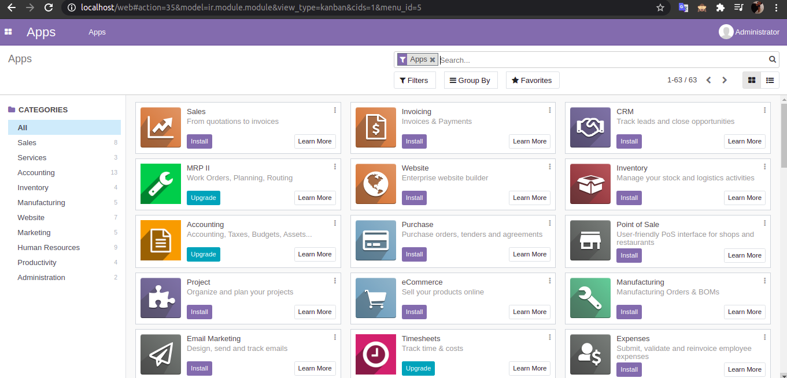

# Odoo ERP, PostgreSQL and Nginx Compose 🔥 🇧🇷

  + Odoo
  + PostgreSQL
  + Nginx 
  + Installations and use simplified ❤

## Odoo ERP 🖥️

##  Documentation 📜

+ https://docs.docker.com/
+ https://docs.docker.com/compose/
+ https://www.odoo.com/documentation/14.0/
+ https://nginx.org/en/docs/
+ https://www.postgresql.org/docs/

### Linux Basic Commands 🐧

` sudo apt update && sudo apt upgrade -y `  
` sudo apt install docker docker-compose -y `  
` git clone https://github.com/DanielNery/odoo-docker-compose-nginx-postgresql.git `  
` cd odoo-docker-compose-nginx-postgresql `  
` sudo docker-compose up -d `  

### Windowns or Mac Tutorial 🍎

  + Install Docker Desktop https://www.docker.com/products/docker-desktop/
  
    ` git clone https://github.com/DanielNery/odoo-docker-compose-nginx-postgresql.git `  
    ` cd odoo-docker-compose-nginx-postgresql `  
    ` docker-compose up -d `  

### Update or custom modules 🍺
  
  `docker-compose stop odoo && sudo docker-compose run --rm odoo odoo -c /etc/odoo/odoo.conf -u your_module 
  --stop-after-init && docker-compose start odoo`  
  
### Contact 📞
  
  + Linkedin: https://www.linkedin.com/in/danielpontesnery/
  + Email: danielpontesnery@gmail.com
  
